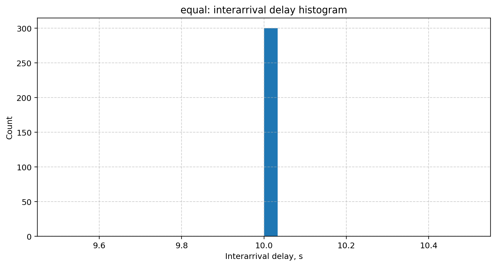
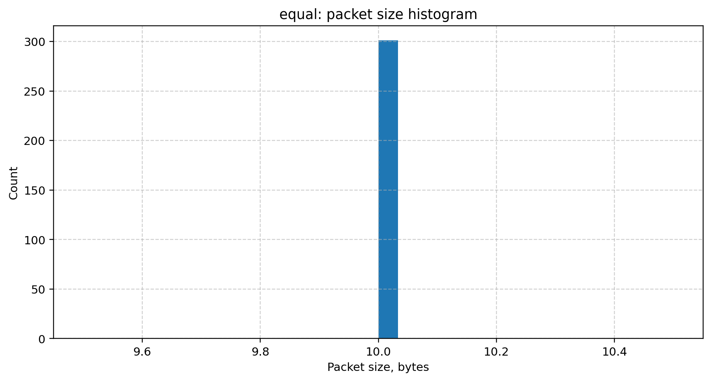
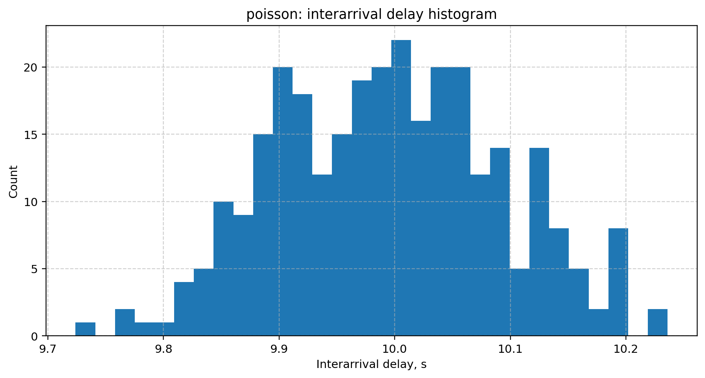
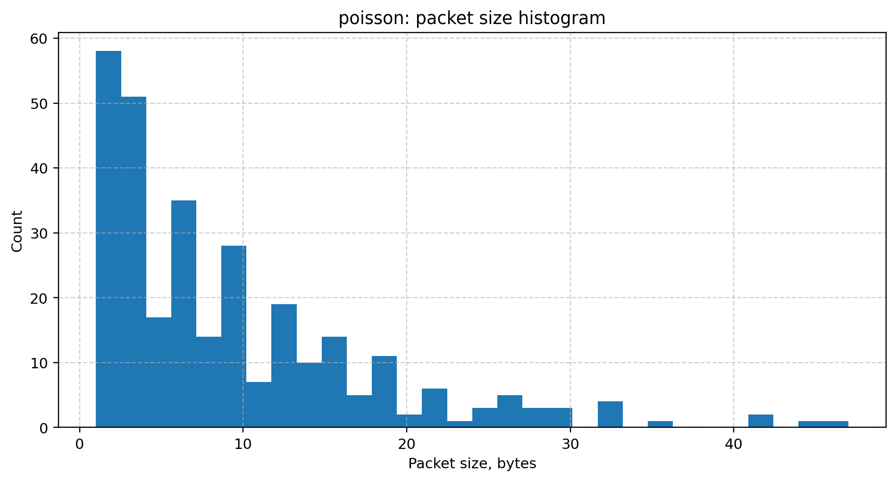

# trafficmodel

A simple traffic simulation project. The C++ part generates packet traffic and saves it to CSV. The Python part reads the CSV file, calculates basic statistics and builds plots.

Supported models:

- Equal traffic model
- Poisson traffic model

## Build

```bash
cmake -S cpp -B cpp/build
cmake --build cpp/build
```

## Run C++ part

```bash
./cpp/build/trafficmodel examples/equal_10_10.txt examples/results/equal/output.csv 67
```

Arguments:

```bash
./cpp/build/trafficmodel <input_file> <output_csv> <seed>
```

## Run Python part

```bash
python3 python/analyze_traffic.py examples/results/equal/output.csv --model equal --out-dir examples/results/equal/plots
```

Arguments:

```bash
python3 python/analyze_traffic.py <output_csv> --model <model_name> --out-dir <plots_dir>
```

## Run All-in-One Bash script

This project provides ready-to-go bash script

```bash
./start_traffic_model.sh
```

Arguments:

```bash
./start_traffic_model.sh <input_config> <output_csv> <model_name> <simulation_seed> <output_dir>
```

Default values

```bash
INPUT_FILE="examples/equal_10_10.txt"
OUTPUT_CSV="examples/results/equal/output.csv"
MODEL_NAME="equal"
SEED="67"
OUTPUT_DIR="examples/results/equal/plots"
```

## Example Plots

### Equal Model





### Poisson Model



